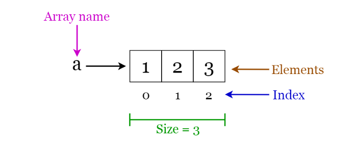

<h1>Arrays</h1>
 

## What are Arrays?

An array is a structure of fixed-size, which can hold items of the same data type. It can be an array of integers, an array of floating-point numbers, an array of strings or even an array of arrays (such as 2-dimensional arrays). Arrays are indexed, meaning that random access is possible.

## Array Operations

Arrays have 5 types of operations:

- Traversal - Going through the array once
- Searching - Searching the array for a specific value
- Update - Updating the array at a given index
- Insertion - This cannot be done simply as size of arrays is immutable(can't be changed). So you need to define another array with length = len(orig_arr)+1
- Deletion - This cannot be done simply as size of arrays is immutable. So you need to define another array with length = len(orig_arr)-1

## Array Applications

- They are used to implement higher level of data structures like ArrayLists, Heaps, Hash Tables, etc.

## Array Algorithms

#### 1) Traversal Algorithm:

There is only one algorithms for traversal. You can go front to back or back to front. You set a counter to 0 and go on till it is less than len(arr). Then you access each entry for that using the pointer and do the operation and then reassign it.  In some languages like  Java and Python, instead of referring by indices to each, we can loop over the array using enhanced for loops and directly do traversal without a counter.

#### 2) Insertion Algorithm:

Insertion uses another array with length len(arr)+1. It copies all the elements till the one to be inserted then we insert the value to be inserted and then insert the rest of the array. Then we delete overwrite the original array with the new one.

#### 3) Deletion Algorithm:

Deletion uses another array with length len(arr)-1. We copy all the elements except the element to be deleted and then overwrite the original array with the new one.

#### 4) Searching Algorithms:

There are many Searching algorithms famous in the Coding community. The most prominent are:

- Linear Search
- Binary Search

there are many more like Jump Search, Interpolation Search, Exponential Search, etc.

Links to Searching Algorithms:

- [GeeksForGeeks Searchinhg Algorithms](https://www.geeksforgeeks.org/searching-algorithms/)
- [TutorialsPoint Page for Searching Algorithms](https://www.tutorialspoint.com/data_structures_algorithms/)
