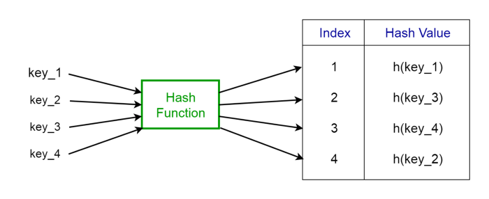

<h1>Hash Table</h1>
 

## What are Hash Tables?

A Hash Table is a data structure that stores values which have keys associated with each of them. Furthermore, it supports lookup efficiently if we know the key associated with the value. Hence it is very efficient in inserting and searching, irrespective of the size of the data.
Direct Addressing uses the one-to-one mapping between the values and keys when storing in a table. However, there is a problem with this approach when there is a large number of key-value pairs. The table will be huge with so many records and may be impractical or even impossible to be stored, given the memory available on a typical computer. To avoid this issue we use hash tables.

## Hash Function

A special function named as the hash function (h) is used to overcome the aforementioned problem in direct addressing.
In direct accessing, a value with key k is stored in the slot k. Using the hash function, we calculate the index of the table (slot) to which each value goes. The value calculated using the hash function for a given key is called the hash value which indicates the index of the table to which the value is mapped.
### h(k)=k%m
- h: Hash function
- k: Key of which the hash value should be determined
- m: Size of the hash table (number of slots available). A prime value that is not close to an exact power of 2 is a good choice for m.

Consider the hash function h(k) = k % 20, where the size of the hash table is 20. Given a set of keys, we want to calculate the hash value of each to determine the index where it should go in the hash table. Consider we have the following keys, the hash and the hash table index.

- 1 → 1%20 → 1
- 5 → 5%20 → 5
- 23 → 23%20 → 3
- 63 → 63%20 → 3

From the last two examples given above, we can see that collision can arise when the hash function generates the same index for more than one key. We can resolve collisions by selecting a suitable hash function h and use techniques such as chaining and open addressing.

## Applications of Hash Tables

- Used to implement database indexes.
- Used to implement associative arrays.
- Used to implement the “set” data structure.

## Resources

- [Hash Table - TutorialsPoint](https://www.tutorialspoint.com/data_structures_algorithms/hash_data_structure.htm)
- [Basics of Hash Tables - HackerEarth](https://www.hackerearth.com/practice/data-structures/hash-tables/basics-of-hash-tables/tutorial/)
- [Hash Tables Explained - Your Basic](https://yourbasic.org/algorithms/hash-tables-explained/)
- [Hash Tabels - Educative](https://www.educative.io/edpresso/what-is-a-hash-table)
- [Hash Tables - Programiz](https://www.programiz.com/dsa/hash-table)
  
-[Hashing and Hash Tables - SaurabhSchool](https://www.youtube.com/playlist?list=PLTZbNwgO5ebqw1v0ODk8cPLW9dQ99Te8f)
- [Hashing And Hash Tables - GeeksForGeeks](https://www.youtube.com/playlist?list=PLqM7alHXFySGwXaessYMemAnITqlZdZVE)
- [Hash Tables - Abdul Bari](https://www.youtube.com/watch?v=mFY0J5W8Udk)
- [Hash Tables - Hackerrank](https://www.youtube.com/watch?v=shs0KM3wKv8)
- [Hash Tables - Paul Programming](https://www.youtube.com/watch?v=MfhjkfocRR0)
- [Hash Map - Codebasics](https://youtu.be/ea8BRGxGmlA)
