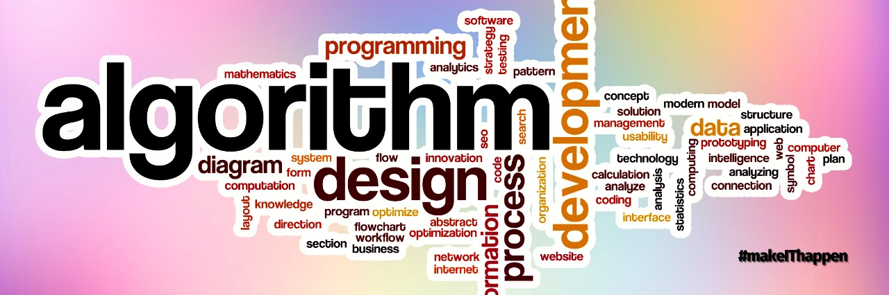

# ⚡ Data Structures & Algorithms - A Comprehensive Guide

<b>A Comprehensive Guide on Data Structures & Algorithms<b>

## Table of Contents
* <a href="Traditional Method">Traditional Method</a>
* <a href="Unconventional Method">Unconventional Method</a>
* <a href="Test Your Knowledge!">Test Your Knowledge!</a>

---
### <a id="Traditional Method">Traditional Method</a>
*The solid easy route to go down the data structures and algorithms hill, risk free and widely used, follow through:*
  1. [Arrays](Arrays.md)
  2. [Linked List](LinkedList.md)
  3. [Stacks](Stack.md)
  4. [Queues](Queue.md)
  5. [Hash Tables](HashTable.md)
  6. [Trees](Tree.md)
  7. [Heaps](Heap.md)
  8. [Graphs](Graph.md)

[Also Check Out some Popular Algorithms And Practice Problems](Algorithm.md)
 
**! Make sure you go through each of these in detail, the explanation is also provided in each individual link!**

### <a id="Unconventional Method">Unconventional Method</a>
*If you are not interested in going down the traditional route of learning each type, There are courses that cover entirety of Data Structures:*

- [All Data Structures 8 hour course by William Fiset](https://youtu.be/RBSGKlAvoiM)
- [In Depth Algorithms Playlist by Abdul Bari](https://www.youtube.com/playlist?list=PLDN4rrl48XKpZkf03iYFl-O29szjTrs_O)
- [Data Structures And Algorithms course for GATE](https://www.youtube.com/playlist?list=PLEVDNf7p-wYyh712BgmW9UGrAc88bl3OF)
- [Stanford Algorithms Course](https://www.youtube.com/playlist?list=PLXFMmlk03Dt7Q0xr1PIAriY5623cKiH7V)
- [Algorithms MIT Course](https://www.youtube.com/playlist?list=PLUl4u3cNGP61Oq3tWYp6V_F-5jb5L2iHb)

### <a id="Test Your Knowledge!">Test Your Knowledge!</a>
*After learning all this to gain an edge over others, you need to practice and keep practicing. There are some websites to learn and practice daily:*

- [Leet Code](https://leetcode.com/)
- [InterviewBit](https://www.interviewbit.com/)
- [Hackerrank](https://www.hackerrank.com/)
- [CodeWars](https://www.codewars.com/)
- [CodinGame (A fun way to code with games)](https://www.codingame.com/start)
---

**How to Contribute**
---
1. Clone repo and create a new branch: `$ git checkout https://github.com/CSI-SFIT/CSI-Website -b name_for_new_branch`.
2. Make changes and test.
3. Submit Pull Request with comprehensive description of changes.

**Acknowledgements**
---

**CSI SFIT Tech Team 2020 - 2021 :**
+ Tech Executive : [@Varun-Patkar](https://github.com/Varun-Patkar)
+ Tech Executive : [@EktaMasrani](https://github.com/ekta18)

 

  

